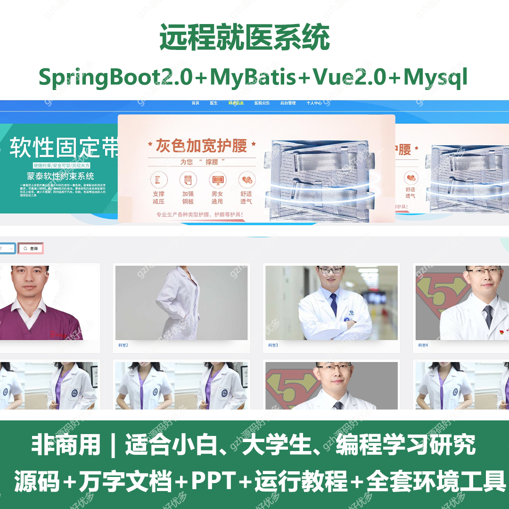
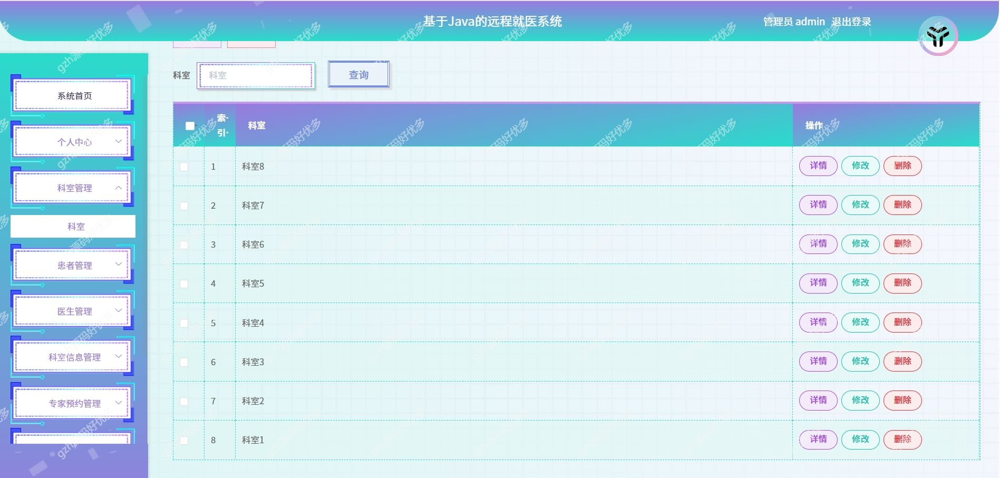
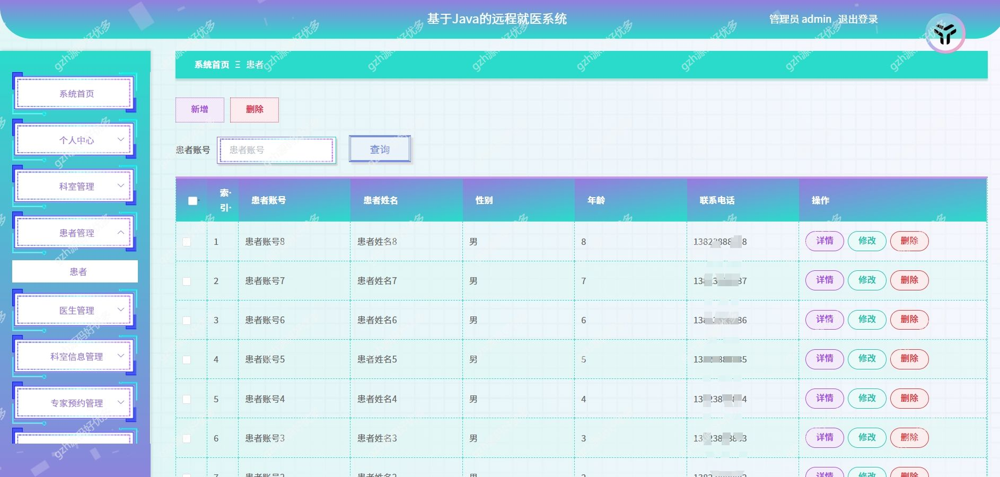
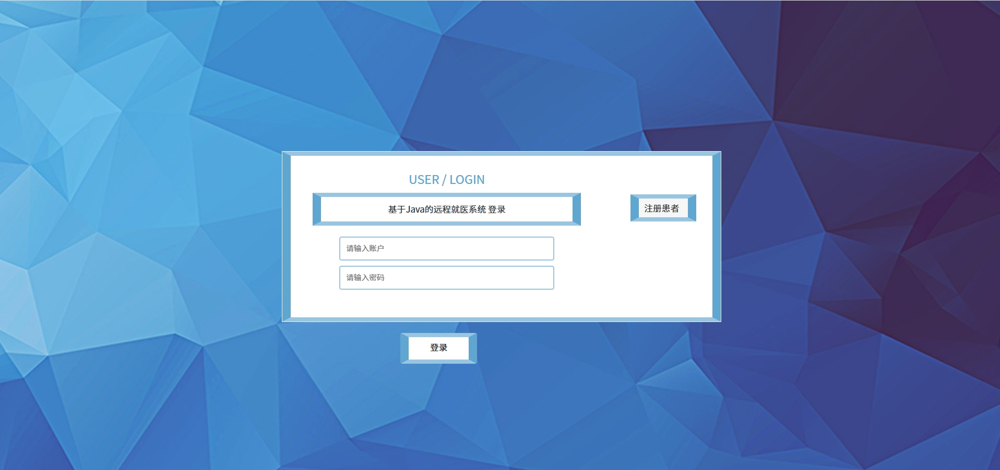
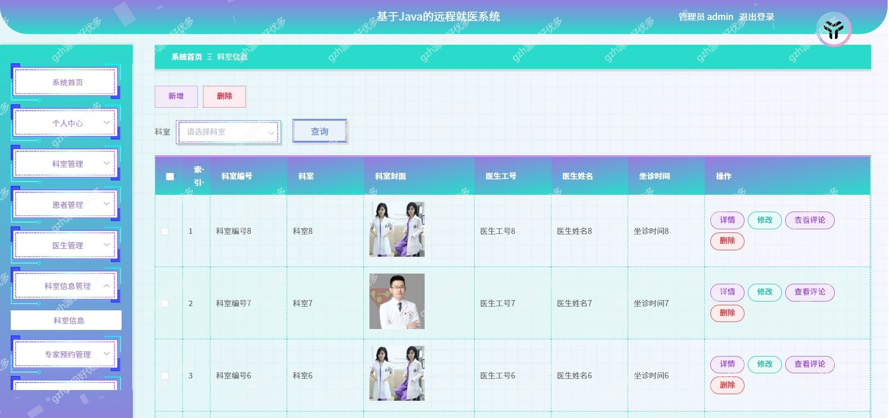
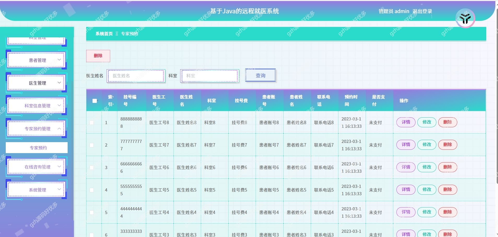
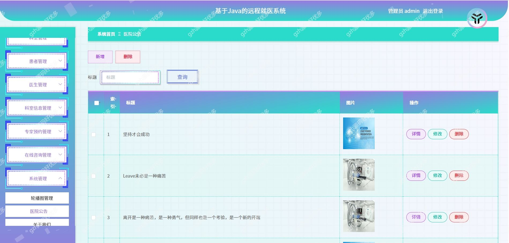
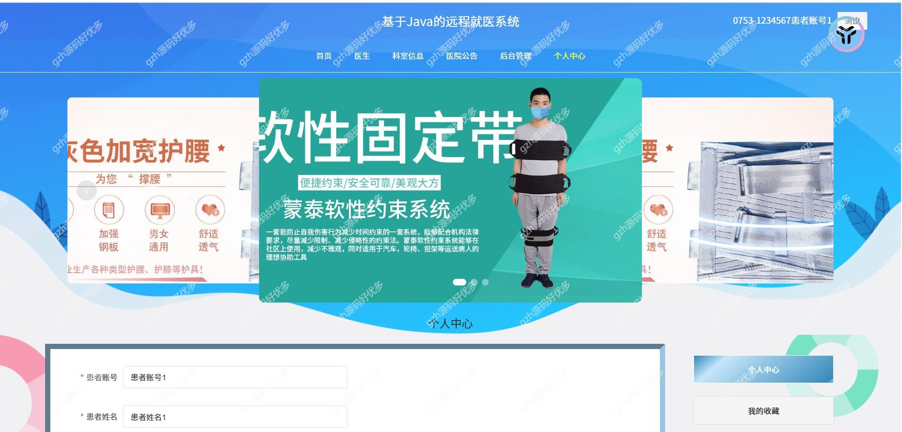

# springbootA320
springbootA320远程就医系统
 
## 查看主页获取源码

### 一、关键词
远程就医系统，就医系统

### 二、作品包含
源码+数据库+万字设计文档+PPT+全套环境和工具资源+本地部署教程

### 三、项目技术
前端技术：Html、Css、Js、Vue2.0、Element-ui 
后端技术：Java、SpringBoot2.0、MyBatis

### 四、运行环境（以下版本亲测，其他版本兼容性请自行测试）
开发工具：IDEA/eclipse  + VSCODE
数据库：MySQL5.7

数据库管理工具：Navicat10以上版本

环境配置软件： JDK1.8 + Maven3.6.3

前端Nodejs：14

浏览器：谷歌浏览器

### 五、项目介绍

项目编号：springbootA320
随着网络科技的不断发展以及人们经济水平的逐步提高，网络技术如今已成为人们生活中不可缺少的一部分，而信息管理系统是通过计算机技术，针对用户需求开发与设计，该技术尤其在各行业领域发挥了巨大的作用，有效地促进了远程就医的发展

个人中心、科室管理、患者管理、医生管理、科室信息管理、专家预约管理、在线咨询管理、系统管理等功能

### 六、运行截图

